Web server on Ubuntu 16.04 LTS
======================

Ubuntu 16.04 LTS 환경에서의 웹 서버 세팅 방법을 다룬 한국어 메뉴얼입니다. 이 문서에서는 Nginx와 php를 연동시키고, Tomcat과 Java를 연동시키고, node.js까지 설치해 봅니다. Tomcat과 Nginx의 포트도 변경합니다. DB는 MaridDB를 설치합니다. 또한 git 저장소도 생성해봅니다. 이 가이드에서 필요한 것만 골라서 사용하십시오.
이 문서는 AWS를 이용하든 vagrant를 이용하든 Ubuntu 16.04 LTS 를 사용할 환경을 갖춘 이후를 다룬 가이드입니다. 기본적인 리눅스 명령어에 대한 설명는 제타위키 등에서 검색하시면 찾을 수 있습니다.

# 0. 목차
```
1. 시작
    1-1. root권한 얻기
    1-2. 시스템 패키지 업데이트
2. 시스템 설정
    2-1. 시스템 시간 설정 (권장)
    2-2. Hostname 변경 (옵션)
    2-3. SSH및 FTP Root접속 권한 설정 (옵션)
3. Nginx 웹 서버 설치하기
    3-1. 저장소 등록
        3-1-1. 저장소 보안키 등록
        3-1-2. 저장소 경로 추가
    3-2. 저장소 적용 및 설치
    3-3. 권장 설정
4. MariaDB 설치
    4-1. 저장소 추가
        4-1-1. 저장소 보안키 등록
        4-1-2. 저장소 경로 추가
    4-2. 저장소 적용 및 설치
5. PHP 설치하기
    5-1. 저장소 추가
    5-2. 설치
    5-3. php 설정
        5-3-1. timezone 설정
        5-3-2. 기본 언어셋 설정
    5-4. nginx - php 연동
        5-4-1. nginx 사용자 권한 변경
        5-4-2. Nginx 에서 PHP 확장자를 갖는 파일에 대한 처리를 PHP-FPM에게 요청하도록 설정
        5-4-3. nginx - php 연동 테스트
    5-5. phpMyAdmin 설치
        5-5-1. [옵션]phpMyAdmin을 RDS에 연결하기
6. Java 및 Tomcat 설치하기
    6-1. Java 설치하기
        6-1-1. JRE, JDK설치
        6-1-2. Java Home 환경 설정
    6-2. Tomcat 설치하기(8.5)
    6-3. Apache Tomcat 테스트
    6-4. (옵션) 톰켓의 포트 번호 변경
7. node.js 설치하기 (작성 예정)
8. Git 최신버전 설치하기
    8-1. Git 설치
    8-2. Git의 사용
        8-2-1. 최초 설정
        8-2-2. 저장소/원격 저장소의 개념
        8-2-3. 실제 서버에서 실습(AWS기준)
```

# 1. 시작

시스템을 사용하기 위해 관리자(root) 권한을 얻고, 업데이트를 진행합니다.

## 1-1. root 권한 얻기
```shell
$ whoami -- 사용자 확인하기
```

AWS 의 경우 유저 이름이 ubuntu,  Homestead vagrant를 사용했을 경우 vagrant 등으로 나타날 것입니다.
```shell
$ sudo su -- 관리자 권한 얻기
```

이제 root 권한을 얻어 $가 #으로 변경된것을 볼 수 있습니다. root권한이 있다면 `sudo`를 일일히 입력하지 않아도 됩니다.

이제 보안을 위해 ubuntu와 root의 비밀번호를 설정해줍니다. 연습중에는 생략해도 괜찮습니다. 혹은 설정 할 때마다 비밀번호 입력하기 귀찮다면 전부 다 세팅한 뒤 설정해줘도 괜찮습니다.
```shell
sudo passwd ubuntu -- 유저 비밀번호 변경
sudo passwd root -- 루트 비밀번호 변경
```

## 1-2. 시스템 패키지 업데이트
apt는 Ubuntu 에서 프로그램 패키지를 다운로드 하고 설치하는 패키지 관리자입니다. `apt-get --help` 라는 명령을 내리면 설명과 사용법이 나타나니 참고하십시오. Amazon Linux 나 CentOS 등에선 yum을 사용하기도 합니다.
리눅스든 윈도우든, 어떤 OS이든 처음 사용할 땐 업데이트를 합니다.
```shell
sudo apt-get update -- 패키지 목록 갱신
sudo apt-get upgrade -- 현재 운영체제에 설치되어 있는 프로그램을 최신 버전으로 패치
```

`apt-get upgrade` 를 진행할 때 선택지가 나타나는데, `Keep the local version currently installed`를 선택합니다.

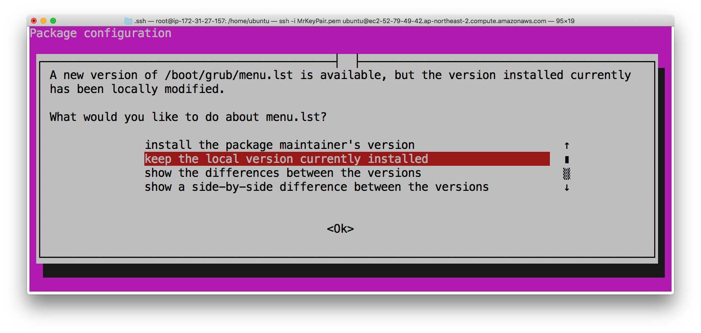

# 2. 시스템 설정

기본적인 시스템 설정을 합니다. 앞으로 root 권한을 가지고 한다는 가정하에 `sudo`명령을 생략하고 진행합니다.

## 2-1. 시스템 시간 설정 (권장)
```shell
dpkg-reconfigure tzdata
```
이후 나타나는 GUI 설정에서 Asia, Seoul 을 차례로 선택합니다.

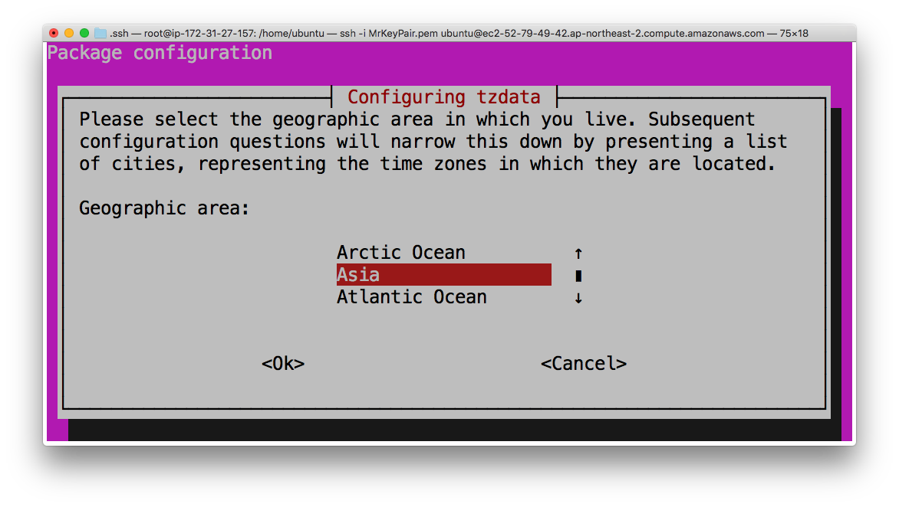

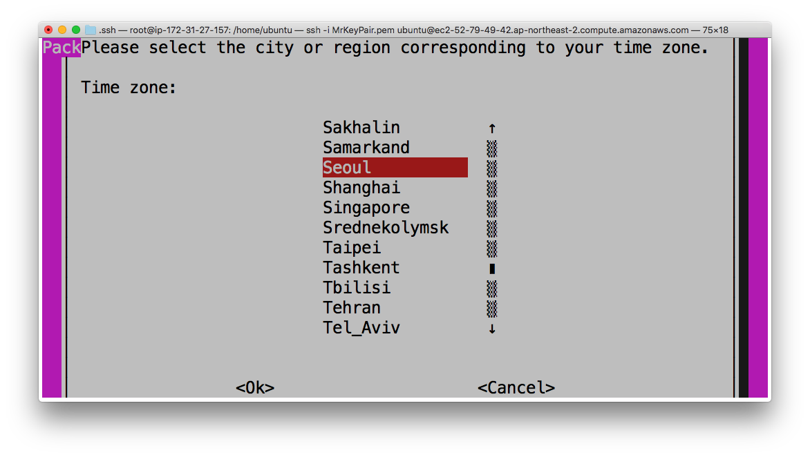


## 2-2. Hostname  변경 (옵션)

hostname 파일에는 서버의 이름이 기록되어 있습니다. 이를 이름을 원하는 이름으로 변경합니다. ( 수정하기 위해 키보드의 `i`를 눌러 insert 모드로 들어갑니다.  `esc`를 누르면 모드를 나갈 수 있습니다. `:wq` 를 입력한 후 `enter(혹은 return)`을 입력하면 저장 후 나가기가 됩니다.  vi의 자세한 사용법은 다른 문서를 찾아보십시오.)
```shell
vi /etc/hostname
```

또한 변경한 이름을 `hosts`에 등록해야 합니다. 예컨대 `myserver`라고 이름지었다면, `127.0.0.1 localhost` 아래에 `myserver`를 등록합니다.
```shell
vi /etc/hosts
```

```shell
127.0.0.1   myserver
```
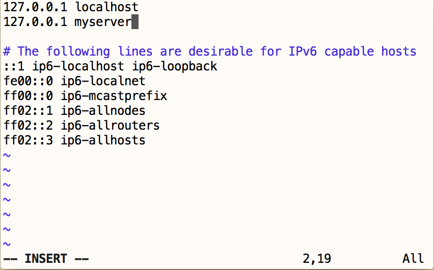

이제 변경한 내용을 적용합니다. 아래 명령어를 입력한 뒤, 서버에 재 접속하면 설정이 적용되어 `ubuntu@myserver`등으로 변경 된 것을 확인할 수 있습니다.
```shell
hostname -F /etc/hostname
```


### 2-3. SSH및 FTP Root접속 권한 설정 (옵션)
AWS의 경우, 처음 EC2를 생성하면 ssh및 ftp접속 권한이 ubuntu 유저로만 활성화되어 있고 root 계정 접속 허가는 비활성화 되어 있습니다. 물론 ssh접속을 하면 ubuntu 유저는 sudo 명령을 이용해서 root 권한을 사용할 수 있지만, FTP를 이용할 땐 권한을 얻기 힘들어 불편한 점이 있습니다. `/home/ubuntu` 디렉토리 외에는 FTP를 통해 파일을 추가/삭제/수정할 권한이 없어서 작업시에 불편할 수 있습니다.

root 권한이나 sudo 명령어를 통해서 sshd_config파일을 vi편집기로 수정합시다.
```shell
vi /etc/ssh/sshd_config
```

`PermitRootLogin` 를 찾아서 yes로 변경해줍니다. 편집기에서 i 를 누르면 insert모드로 들어가 수정이 가능해지고, esc를 누른 뒤 :wq 를 입력하면 저장후 터미널로 돌아옵니다. ( :q 는 나가기, :q! 는 강제로 나가기 입니다. q!의 경우 sudo 권한 없이 수정을 시도했다가 권한이 없어 저장할 수 없을 때 편집을 무시하고 터미널로 돌아갈 때 사용됩니다.) 기존의 `PermitRootLogin` 항목은 주석으로 처리하거나(#을 앞에 써주면 됨) 지워버립시다.


이제 ubuntu 유저의 ssh key를 루트에 복사해줍니다. `/root/.ssh` 디렉토리가 없다면 `mkdir /root/.ssh` 로 생성해줍니다.

```shell
cp /home/ubuntu/.ssh/authorized_keys /root/.ssh/
```

이제 외부에서 ssh및 ftp를 root 계정으로 원격 접속 할 수 있습니다.


# 3. Nginx 웹 서버 설치하기
이제 본격적으로 웹서비스를 준비합니다. 그냥 `apt-get install nginx`라고 명령해도 설치가 되긴 합니다만, 공식 저장소는 최신화 되어 있지 않은 경우가 많아 옛 버전이 설치됩니다. 최신 버전을 사용하려면 최신버전의 저장소를 `apt-get` 패키지에 등록해야 합니다.

## 3-1. 저장소 등록
nginx 최신 버전의 저장소를 apt-get패키지에 추가합니다. 등록 방법은 [여기](http://nginx.org/en/linux_packages.html)에서 배울 수 있습니다.

### 3-1-1. 저장소 보안키 등록
저장소를 등록하기 위한 첫 번째 절차입니다. `root`로 이동하기 위해선 권한을 획등해야 합니다. (`sudo su`)
```shell
cd /root -- root 디렉토리로 이동
wget http://nginx.org/keys/nginx_signing.key -- 인증키 다운로드
apt-key add nginx_signing.key -- 다운 받은 키를 서버에 등록
rm nginx_signing.key -- 등록 완료 후 필요 없어진 파일 삭제
```
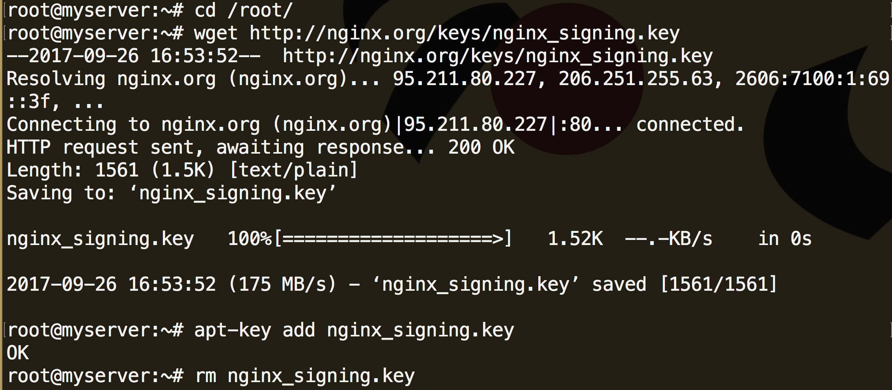

### 3-1-2. 저장소 경로 추가
저장소를 등록하기 위한 두 번째 절차입니다. `apt/source.list` 에 저장소의 경로를 추가합니다.
```sh
vi /etc/apt/sources.list
```

해당 파일의 최하단에 아래 내용을 입력합니다.
```shell
# Nginx
deb http://nginx.org/packages/mainline/ubuntu/ xenial nginx
deb-src http://nginx.org/packages/mainline/ubuntu/ xenial nginx
```


이때, `xenial`은 `Codename`으로, ubuntu의 버전과 관계있습니다. [여기](http://nginx.org/en/linux_packages.html)에서 `Codename`을 확인할 수 있습니다. Ubuntu 16.04 외의 버전을 사용하신다면 해당 값을 변경하십시오.
```
Debian:

Version     Codename     Supported Platforms
7.x     wheezy     x86_64, i386
8.x     jessie     x86_64, i386
9.x     stretch     x86_64, i386

Ubuntu:

Version     Codename     Supported Platforms
12.04     precise     x86_64, i386
14.04     trusty     x86_64, i386, aarch64/arm64
16.04     xenial     x86_64, i386, ppc64el, aarch64/arm64
16.10     yakkety     x86_64, i386
```

## 3-2. 저장소 적용 및 설치

이제 바뀐 내용을 적용하기 위해 업데이트 합니다.
```shell
apt-get update
```

새로 설치한다면 `apt-get install nginx`, 이미 깔려있다면 `apt-get upgrade`를 통해 버전을 최신화 할 수 있습니다. 설치하면 자동으로 실행됩니다. 또한 재부팅시 자동실행 되는 것이 기본 설정이라 따로 서비스를 등록해줄 필요는 없습니다.

```shell
apt-get install nginx
```

재대로 설치되었는지 확인하기 위해 버전을 확인합니다.

```shell
nginx -v
```


서버 재시작도 잘 되는지 체크해봅시다.
```shell
service nginx restart
```

nginx는 기본적으로 80 포트를 사용합니다. 웹브라우저를 켜고 서버의 아이피(http://111.222.333.444 등)에 접속해서 동작 여부를 확인합니다. Welcome to nginx! 문구가 뜨면 정상입니다. `apt-get`으로 설치하였을 때, 이 파일의 기본 위치는 `/usr/share/nginx/html/index.html` 입니다.


[trouble shooting]
1) "응답하는 데 시간이 너무 오래 걸립니다." 라며 페이지가 접속되지 않을 때는 포트가 열려있는지 먼저 확인해보세요. nginx의 default port는 80입니다. AWS의 경우, Security group 의 초깃값이 22번 포트만 열려 있습니다. 여기서 80포트를 열면 문제가 해결될 수 있습니다.

## 3-3. 권장 설정

nginx의 기본 설정만으로도 웹 서비스를 운영하는데 큰 문제는 없지만, 설정을 변경해줌으로서 보안과 성능을 향상시킬 수 있습니다. 몇 가지 권장되는 설정을 기록합니다.

### 3-3-1. nginx.conf

`nginx.conf`의 권장 설정입니다.

```shell
vi /etc/nginx/nginx.conf
```

```shell
#성능 이 좋은 컴퓨터를 이용할 때 성능이 향상됩니다.
#(기본값은 1이라서 싱글스레드로 동작합니다. auto로 사용되는 core수를 자동으로 맞춰줍니다)
worker_processes  auto;

events {
    ...
    # 한 번에 복수의 접속을 허가합니다.
    multi_accept on;
    ...
}

http {
    #response header에 nginx 버전 표시 여부를 결정합니다.
    #보안을 위해 off를 해줍시다.
    server_tokens off;

    #response header 에 charset 을 부여합니다.
    charset utf8mb4;

    #웹서버에서 수신할 수 있는 최대 패킷 크기를 정의합니다.
    #기본값은 1MB 이며, 더 큰 파일의 업로드를 허용하려면 이 값을 늘려줘야 합니다.
    #원하는 값으로 바꿉니다.
    client_max_body_size 20M;
}

```


# 4. MariaDB 설치
DB는 MariaDB를 설치합니다.

## 4-1. 저장소 추가
MariaDB의 최신 버전을 설치하기 위해 저장소를 등록합니다. [여기](https://mariadb.com/kb/en/library/installing-mariadb-deb-files/)에서 MariaDB 저장소를 등록하는 방법을 배울 수 있습니다.

### 4-1-1. 저장소 보안키 등록
```shell
apt-key adv --recv-keys --keyserver hkp://keyserver.ubuntu.com:80 0xF1656F24C74CD1D8
```

### 4-1-2. 저장소 경로 추가
nginx 를 등록할 때와 마찬가지로 `apt/source.list` 에 저장소의 경로를 추가합니다.
```shell
vi /etc/apt/sources.list
```

`apt/sources.list`의 최하단에 아래 코드를 삽입합니다.
```shell
# MariaDB
deb http://ftp.kaist.ac.kr/mariadb/repo/10.1/ubuntu xenial main
```


## 4-2. 저장소 적용 및 설치

이제 MariaDB를 설치합니다. 시간이 다소 소요됩니다. 여기서는 10.1버전을 설치합니다.
```shell
apt-get update
apt-get install mariadb-server-10.1 mariadb-client-10.1
```

설치시에 데이터베이스 root 사용자의 비밀번호를 설정합니다. 설치와 동시에 MariaDB 가 실행되며, 재부팅시에도 자동 시작되도록 설정됩니다.
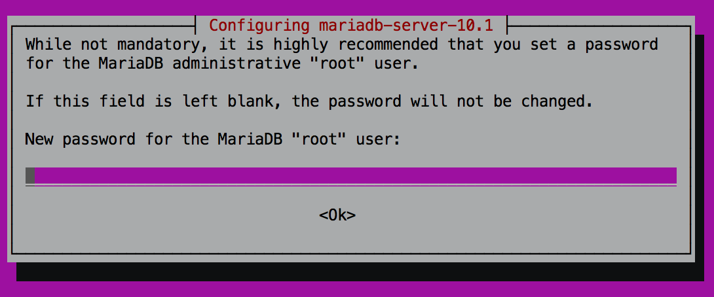

설치가 잘 되었는지 확인하기 위해 서비스 상태를 확인해봅니다.
```shell
service mysql status
```

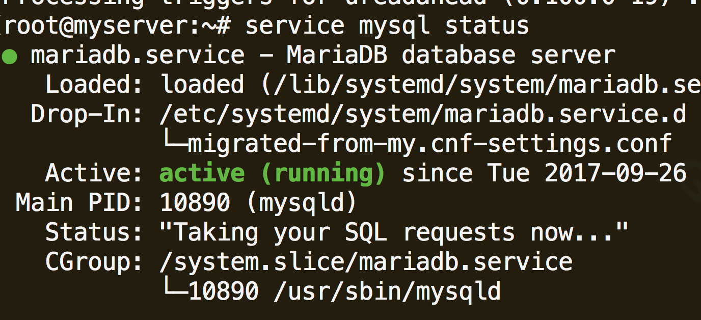

초록색 active (running)이 확인되면 모든 것이 정상입니다. 표시할 정보가 많으면 more 가 나올 수도 있습니다. Q 나 Control+C 를 입력하여 터미널로 돌아올 수 있습니다.


# 5. PHP 설치하기

nginx는 자체적으로 php를 해석하지 못 하기 때문에 php 어플리케이션을 실행하고 싶다면 php를 설치하고, 설정해줘야 합니다. 기본 저장소의 php는 7.0 버전입니다. 여기서는 7.1 버전으로 설치하는 방법을 다룹니다.

## 5-1. 저장소 추가

최신 버전의 패키지는 우분투에 포함되어 있지 않으므로 외부 저장소를 통해 설치해야 합니다. 개인들이 제공하는 PPA(Personal Package Archives)  저장소를 추가하며 이 작업은 루트 권한이 필요합니다.

apt-repository추가를 위해 아래 프로그램들을 설치해야 합니다. 이 프로그램이 없으면 command not found 가 나타납니다.
```shell
apt-get install software-properties-common
```

이제 저장소를 추가합니다.
```shell
add-apt-repository ppa:ondrej/php -- 유저 ondrej가 제공하는 php저장소를 추가함
apt-get update -- 추가한 PPA 의 패키지 정보를 업데이트합니다.
```


## 5-2. 설치

이제 본격적으로 php를 설치합니다. 먼저 기본 패키지를 설치합시다. 만약 7.0 -> 7.1 버전으로 업그레이드 하기 위해 이 문서를 보고 있다면 php가 물려있는 웹 서버를 잠시 꺼줘야 합니다.
```shell
apt-get install php7.1 php7.1-common
```

이제 필요에 따라 추가 패키지를 설치합니다.
```shell
apt-get install php7.1-cli php7.1-sqlite3 php7.1-gd php7.1-json php7.1-curl php7.1-mysql php7.1-readline php7.1-mbstring php7.1-xml php7.1-zip php7.1-intl
```

잘 설치되었는지 확인하기 위해 `php -v` 명령으로 버전을 확인합니다.


이제 `php-fpm`을 설치합니다. 이는 PHP FastCGI Process Manager의 약자로, 일종의 CGI입니다. php의 처리를 빠르게 해준다고 보면 됩니다. apache의 경우에는 apache용 php 모듈이 있어서 자체적으로 처리합니다. 하지만 nginx는 해당 기능을 지원하지 않아서 php-fpm를 따로 설치하여 nginx와 연동시켜야 합니다.
CGI란, php등의 파일을 읽어 html로 반환하는 프로그램입니다. CGI에 대해 더 자세히 알고 싶다면 [여기](https://ko.wikipedia.org/wiki/%EA%B3%B5%EC%9A%A9_%EA%B2%8C%EC%9D%B4%ED%8A%B8%EC%9B%A8%EC%9D%B4_%EC%9D%B8%ED%84%B0%ED%8E%98%EC%9D%B4%EC%8A%A4)를 클릭하세요
```shell
apt-get install php7.1-fpm
```

## 5-3. php 설정
### 5-3-1. timezone 설정
`php.ini` 의 설정을 운영 환경에 맞게 수정합니다. 대상 파일은 php 패키지를 설치할 때 생성된  `/etc/php/7.1/cli/php.ini` 와  `php-fpm` 이 사용하는 `/etc/php/7.1/fpm/php.ini` 2개 입니다.

```shell
vi /etc/php/7.1/cli/php.ini
vi /etc/php/7.1/fpm/php.ini
```

두 파일에서 timezone 항목을 찾아 주석을 풀어주고, 해당 지역에 맞게 설정합니다. 한국일 경우 `Asia/Seoul`로 설정하면 됩니다. vi 에디터에서 `/timezone`을 입력한 뒤 `enter(or return)`키를 입력하면 검색되어 쉽게 찾을 수 있습니다.

```shell
date.timezone = Asia/Seoul
```


변경사항을 적용하기 위해 php service를 재시작합니다.
```shell
service php7.1-fpm restart
```

### 5-3-2. 기본 언어셋 설정
서버의 local 에 설치된 DB를 사용할 경우, 이 단계를 건너뛰면 DB의 인코딩이 `latin1`으로 생성되어 추후 DB작업에 문제가 생길 수 있습니다. `utf8mb4`로 바꿔줍니다.
```shell
vi /etc/mysql/conf.d/mariadb.cnf
```
아래와 같이 수정합니다. (기본으로 포함된 주석 일부를 생략했습니다.)
```shell
# MariaDB-specific config file.
# Read by /etc/mysql/my.cnf

[client]
# Default is Latin1, if you need UTF-8 set this (also in server section)
default-character-set = utf8mb4

[mysqld]
character-set-server = utf8mb4
collation-server = utf8mb4_unicode_ci
character_set_server = utf8mb4
collation_server = utf8mb4_unicode_ci
```
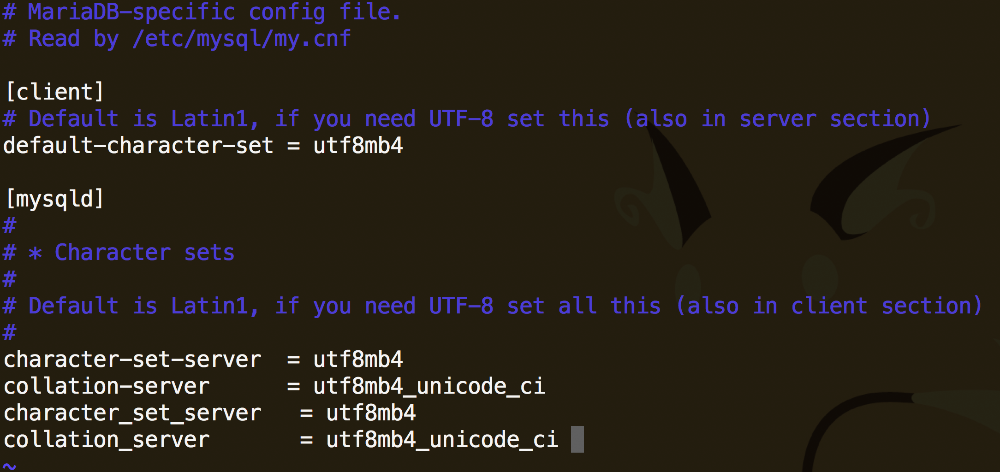

변경사항을 적용하기 위해 재시작합니다.
```shell
service mysql restar
```

## 5-4. nginx - php 연동

위에 언급했듯, nginx는 자체적으로 php를 해석할 수 없기 때문에 nginx가 php를 이해할 수 있게 설정해줘야 합니다.  이 설정은 `/etc/nginx/nginx.conf`가 처리합니다.

### 5-4-1. nginx 사용자 권한 변경
```shell
vi /etc/nginx/nginx.conf
```

첫줄의 user  nginx; 를 user  www-data; 로 바꿉니다. php-fpm의 기본(default) 유저가 www-data입니다. 같은 유저로 설정하여 php-fpm에 대한 권한을 갖게 합니다.
둘째줄의 worker_processes 1; 를 worker_processes auto; 로 바꿉니다. (고사양 서버에서 성능이 더 좋아집니다.)


재시작을 해서 변경 사항을 적용합니다.

```shell
service nginx restart
```

### 5-4-2. Nginx 에서 PHP 확장자를 갖는 파일에 대한 처리를 PHP-FPM에게 요청하도록 설정

nginx.conf 의 서버 설정 파일을 추가합니다. 확장자면 conf 이면 파일 이름은 상관 없습니다.
`/etc/nginx/conf.d/` 디렉토리에 있는 확장자를 conf로 갖는 `*.conf` 파일은 `/etc/nginx/nginx.conf` 에 include됩니다.
우선, 혹시 생길 문제를 대비하여 디폴트 세팅을 저장해둡시다. default.conf 는 디폴트 서버 설정이 포함되어 있습니다.

```shell
cp /etc/nginx/conf.d/default.conf /etc/nginx/conf.d/default.conf.org
```

이제 `default.conf`에 원하는 설정을 추가합시다. 저는 어떤 서버에 대한 설정인지 확인하기 쉽게 이 파일의 이름도 `myserver.conf`로 변경해서 사용하겠습니다. 원하시는 대로 바꾸셔도 되고, 안 바꾸셔도 됩니다.

```shell
mv /etc/nginx/conf.d/default.conf /etc/nginx/conf.d/myserver.conf -- 파일 명 변경(옵션)
vi /etc/nginx/conf.d/myserver.conf -- myserver.conf를 수정
```

안의 내용을 자신에게 맞게 수정합니다.

```shell
server {
    # 여기서 원하는 포트 번호를 수정할 수 있음. 81로 입력하면 81번 포트로 연결됨.
    listen       80 default_server;
    # 사용할 도메인으로 사용하길 권장한다.
    server_name  myhomepage.com www.myhomepage.com;

    #charset koi8-r;
    #access_log  /var/log/nginx/host.access.log  main;

    # root의 값이 메인 디렉토리가 된다. 여기서 입력하는 위치는 예시다.
    # 웹사이트는 주로 /var/www 를 메인 디렉토리로 하는 경우가 많지만 어디든 큰 차이는 없다.
    # 원하는 위치에 세팅하자.
    root       /usr/share/nginx/html;
    #root        /var/www/laravel/mysite/public/;

    location / {    # 여기 있던 root는 삭제하거나 주석 처리한다.
        index  index.php index.html index.htm;
    }

    #error_page  404              /404.html;

    # redirect server error pages to the static page /50x.html
    error_page   500 502 503 504  /50x.html;
    location = /50x.html {
        root   /usr/share/nginx/html;
    }

    # 이 내용을 추가해준다. php7.0 일 경우 7.0-fpm.sock 으로 적용
    location ~ \.php$ {
        fastcgi_split_path_info ^(.+\.php)(/.+)$;
        fastcgi_pass unix:/var/run/php/php7.1-fpm.sock;
        fastcgi_index index.php;
        include fastcgi_params;
        fastcgi_param SCRIPT_FILENAME $document_root$fastcgi_script_name;
        fastcgi_intercept_errors off;
        fastcgi_buffer_size 16k;
        fastcgi_buffers 4 16k;
        fastcgi_connect_timeout 300;
        fastcgi_send_timeout 300;
        fastcgi_read_timeout 300;
    }

    location ~ /\.ht {
        deny  all;
    }
}

```

재시작하여 변경사항을 적용합니다.

```shell
service nginx restart
```


### 5-4-3. nginx - php 연동 테스트

테스트를 위해 nginx 의 메인 디렉토리에 phpinfo() 함수를 포함한 php파일을 생성합니다.

```shell
vi /usr/share/nginx/html/info.php
```

```shell
<?php
phpinfo();
```

웹 브라우저에서 페이지(http://111.222.333.444/phpinfo.php)가 제대로 출력되는지 확인합니다. 이 페이지에서 command(or ctrl)+F 로 “nginx” 와 “php-fpm” 단어로 검색해서 위치 및 동작 여부를 체크해봅시다. “Default timezone”도 확인하여 시계가 제대로 설정되었는지 확인합시다.

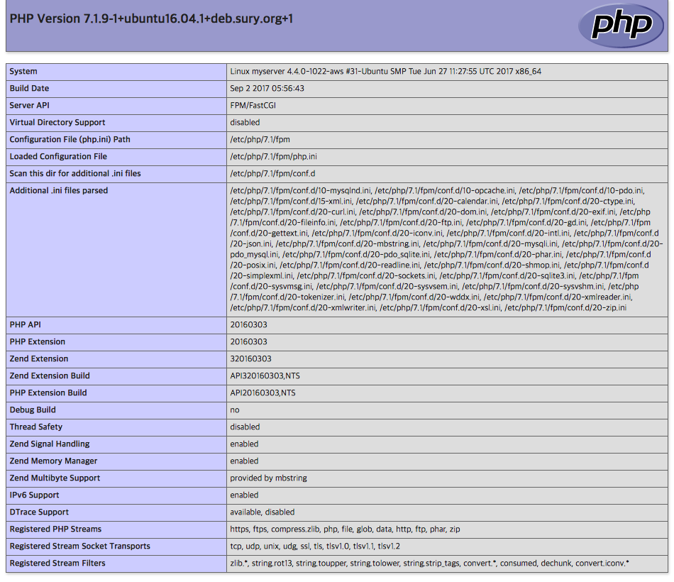

제대로 안 되면 php가 실행되지 않고 다운로드됩니다. 설정값이 잘못되었거나, `server nginx restart` 명령을 안 내렸을 가능성이 높습니다.
file not found가 나타난다면 `*.conf` 값의 root 경로설정이 잘못 되었을 가능성이 높습니다.

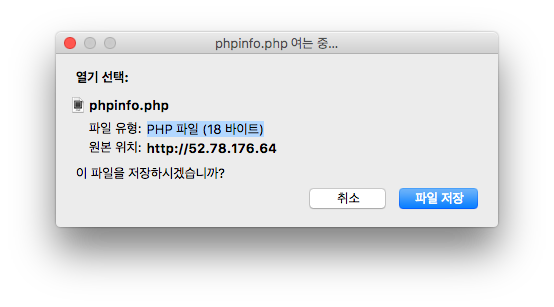

## 5-5. phpMyAdmin 설치
phpMyAdmin 은 mysql(mariaDB)의 관리를 도와주는 툴 입니다. zip(압축) 해제 프로그램을 설치합니다.
```shell
apt-get install unzip
```

nginx의 메인 디렉터리로 이동합니다.
```shell
cd /usr/share/nginx/html
```

[phpMyAdmin공식 홈페이지](https://www.phpmyadmin.net)에서 최신 버전의 phpMyAdmin의 다운로드 주소를 복사하여 wget 로 다운받습니다.
```shell
wget https://files.phpmyadmin.net/phpMyAdmin/4.7.4/phpMyAdmin-4.7.4-all-languages.zip
```

압축을 풀어주고, 접근하기 쉽게 이름을 변경해줍니다. 그 후 다운 받았던 압축 파일은 삭제해주겠습니다.
```shell
unzip phpMyAdmin-4.7.4-all-languages.zip
mv phpMyAdmin-4.7.4-all-languages phpmyadmin
rm phpMyAdmin-4.7.4-all-languages.zip
```

이제 도메인/phpmyadmin (예:http://111.222.333.444/phpmyadmin)으로 접속하면 사용할 수 있습니다. 기본적으로는 루트에 설치된 mysql(mariadb)에 접속됩니다.

이제 php 관련 설치가 끝났습니다. 재부팅을 한 번 해줍시다.
```shell
reboot
```

재부팅 후에 phpinfo 페이지와 phpmyadmin 가 잘 실행된다면 “재부팅이 가능한 서버” 라고 볼 수 있습니다

### 5-5-1. [옵션]phpMyAdmin을 RDS에 연결하기
phpMyAdmin이 다른 서버의 DB를 수정할 수 있도록 하는 옵션입니다. phpmyadmin 폴더 안의 `config.inc.php`를 수정합니다.

```shell
cp config.sample.inc.php config.inc.php -- config.inc.php 파일 복제 (이미 있다면 넘어가셔도 됩니다.)
vi /usr/share/nginx/html/phpmyadmin/config.inc.php
```

여기서, `config.inc.php` 안의
```shell
/**
 * End of servers configuration
 */
```

위에 자신의 환경에 맞게 수정한 뒤 붙여넣습니다.

```shell
…

$i++;
$cfg['Servers'][$i]['host'] = '____your_DB_address(Endpoint)____';
$cfg['Servers'][$i]['port'] = '3306';
$cfg['Servers'][$i]['socket'] = '';
$cfg['Servers'][$i]['connect_type'] = 'tcp';
$cfg['Servers'][$i]['extension'] = 'mysql';
$cfg['Servers'][$i]['compress'] = TRUE;
$cfg['Servers'][$i]['auth_type'] = 'config';
$cfg['Servers'][$i]['user'] = '____your_user_id____';
$cfg['Servers'][$i]['password'] = '____your_password____';


/**
 * End of servers configuration
 */

…
```

이제 phpMyAdmin을 이용해서 원격DB 접속이 가능합니다.

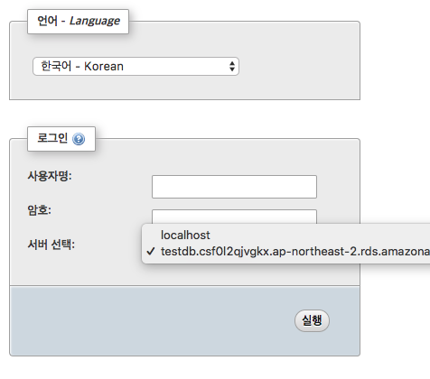

# 6. Java 및 Tomcat 설치하기
Spring 등으로 작성된 웹 어플리케이션을 실행하기 위해선 Java와 Tomcat이 필요하죠. 이를 설치해봅니다.

## 6-1. Java 설치하기
### 6-1-1. JRE, JDK설치
이 단계에서는 Ubuntu PPA 저장소에서 Java JRE 및 JDK를 설치합니다. 먼저 저장소 관리를 위한 패키지인 `python-software-properties`를 설치해야 합니다. 여기서는 Java 1.8을 설치합니다.

```shell
apt-get install python-software-properties -y
```

패키지가 설치되면 새로운 PPA java 저장소를 추가하고 `apt-get update`를 실행합니다. 저장소를 추가할 때 `Enter`를 요구하는데, 요구대로 해줍시다.
```shell
add-apt-repository ppa:webupd8team/java
apt-get update
```

apt를 사용하여 PPA 저장소에서 Java JRE 및 JDK를 설치합니다. Oracle의 약관에 동의하시면 설치가 진행됩니다.
```shell
apt-get install oracle-java8-installer -y
```

설치 과정에서 Oracle사의 라이센스 정책 동의 여부를 물어봅니다.
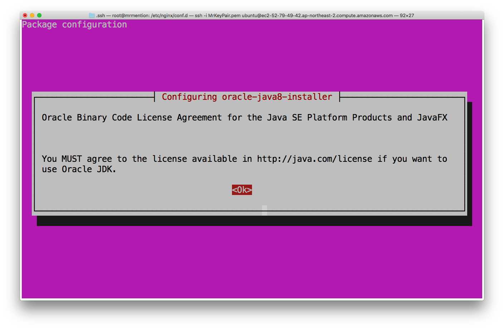


설치가 완료되면 버전 체크를 하여 제대로 설치되었는지 확인합니다.
```shell
java -version
```
### 6-1-2. Java Home 환경 설정
첫 번째 단계에서는 Java를 설치했습니다. 이제 Java 응용 프로그램이 Java 설치 디렉토리를 찾을 수 있도록 Ubuntu 서버에서 JAVA_HOME 환경 변수를 구성해야 합니다. Tomcat은 제대로 설정하려면 JAVA_HOME 환경이 필요합니다. JAVA_HOME 환경을 설정하기 전에 Java 디렉토리의 위치를 ​​알아야합니다. 아래 명령을 사용하여 Java 디렉토리의 위치를 ​​확인하십시오.

```shell
update-alternatives --config java
```

그럼 이제 vi나 vim 으로 `environment` 파일을 수정하여 환경 설정을 합시다. 최하단에 다음 내용을 써주세요.
```shell
vi /etc/environment
```

```shell
JAVA_HOME="/usr/lib/jvm/java-8-oracle/jre"
```


다음으론 `.bashrc` 를 수정합니다. 마찬가지로 최하단에 다음 내용을 써주세요.
```shell
vi ~/.bashrc
```

```shell
export JAVA_HOME=/usr/lib/jvm/java-8-oracle/jre
export PATH=$JAVA_HOME/bin:$PATH
```

저장한 뒤, `.bashrc`를 재시작 합니다.
```shell
source ~/.bashrc
```

작업에 문제가 없을을 확인합니다.
```shell
echo $JAVA_HOME
```

## 6-2. Tomcat 설치하기(8.5)
이제 본격적으로 Tomcat을 설치합니다. 먼저 Tomcat 유저 및 그룹을 생성합니다.
```shell
groupadd tomcat
useradd -s /bin/false -g tomcat -d /opt/tomcat tomcat
```

다음으로, 원하는 위치로 가서 톰켓을 다운받습니다. 여기서는 /opt 로 이동합니다. 원하는 버전의 다운로드 링크를 톰켓 [공식홈페이지](http://tomcat.apache.org/)에 가서 확인합니다. 여기서는 8.5 버전을 사용합니다.

```shell
cd /opt/
wget http://apache.tt.co.kr/tomcat/tomcat-8/v8.5.23/bin/apache-tomcat-8.5.23.tar.gz
```

압축을 풀고 이름을 변경해 줍니다.

```shell
tar -xzvf apache-tomcat-8.5.20.tar.gz
mv apache-tomcat-8.5.20 tomcat
```

tomcat 디렉토리의 소유자를 tomcat 사용자로 변경하고 bin 디렉토리의 모든 파일을 실행 가능하게 만듭니다.
```shell
chown -hR tomcat:tomcat tomcat
chmod +x /opt/tomcat/bin/*
```

다음에는 Apache Tomcat으로 테스트를 실행할 수 있도록 CATALINA_HOME 디렉토리를 정의해야 합니다. Catalina는 Tomcat 서블릿 컨테이너입니다. vim으로 .bashrc 파일을 편집합니다.

```shell
vi ~/.bashrc
```

최하단에 다음을 추가합니다.
```shell
export CATALINA_HOME=/opt/tomcat
```

저장하고, `.bashrc` 를 다시 실행합니다.
```shell
source ~/.bashrc
```

CATALINA_HOME환경을 확인합니다.
```shell
echo $CATALINA_HOME
```

### 6-3. Apache Tomcat 테스트
이제 모든것이 잘 되었는지 확인합니다.
```shell
CATALINA_HOME/bin/startup.sh
```

Tomcat started 라는 문구를 확인할 수 있으면 제대로 실행 된 것입니다. 다음 명령어를 통해 포트가 제대로 열렸는지 확인합시다. Tomcat은 기본적으로 8080 포트를 사용합니다.
```shell
netstat -plntu
```

모든것이 잘 돌아간다면 이 고양이를 확인할 수 있을 겁니다.


## 6-4. (옵션) 톰켓의 포트 번호 변경
톰켓 디렉토리에서 `tomcat/conf/server.xml` 에서 포트를 변경할 수 있습니다. `/8080` 으로 검색해서 기본으로 설정된 `8080` 포트를 찾아 `80`등 원하는 포트로 수정합시다.

```shell
vi /opt/tomcat/conf/server.xml
```

그리고 톰켓을 재시작하면 적용됩니다. `cd tomcat/bin/` 이동하면 tomcat 실행 파일이 존재하고, 해당 파일을 실행해서 엔진을 켜고 끌 수 있습니다.

tomcat 엔진 중지 `./shutdown.sh`

tomcat 엔진 시작 `./startup.sh`

tomcat 재시작 `systemctl restart tomcat`


# 7. node.js 설치하기(작성예정)


다른 서비스를 설치할 때와 같이 시스템이 업데이트 된 상태에서 진행합니다.
```shell
apt-get update
```

## 7-1. node.js 설치
node.js를 설치합니다.

```shell
apt-get install nodejs
```

설치가 다 되면 nodejs 명령을 입력하여 프롬프트 ">"로 들어가는지 확인하여 node.js가 제대로 설치되었는지 확인합니다.
```shell
nodejs
```

빠져 나가려면 `ctrl+c`를 두 번 입력하거나 `.exit`를 입력한 뒤 'Enter(return)'합니다.

## 7-2. yarn 설치
Node Package Manager인 yarn 을 설치합니다. yarn 은 기존의 node.js의 패키지를 관리자 였던 npm을 쓰다가 불만을 가진 사람들이 만든 패키지 매니저 입니다. 아직 npm을 이용해서도 패키지를 관리할 할 수는 있습니다만, 악명이 자자하길래 yarn을 이용해봅니다. 여느때와 마찬가지로 저장소를 등록해줍니다.

```shell
curl -sS https://dl.yarnpkg.com/debian/pubkey.gpg | sudo apt-key add -
echo "deb https://dl.yarnpkg.com/debian/ stable main" | sudo tee /etc/apt/sources.list.d/yarn.list
apt-get update
```

이제 yarn을 설치합니다.
```
apt-get install yarn
```

`yarn -v`로 버전정보가 나오는 것을 보고 잘 설치되었는지 확인합니다.
```shell
yarn -v
```


## 7-3. Express 설치

Express를 설치합니다. Express에 대해 알고 싶다면 여기를 확인하세요. 옵션 -g는 Global 옵션으로 어느 path에서나 express를 사용할 수 있도록 하는 옵션입니다.
# npm install -g express

Express generator를 설치합니다. 버전은 4.x이며, global 옵션으로 설치합니다.
# npm install -g express-generator@4

Node monitoring을 위해 nodemon을 설치합니다.
# npm install -g nodemon

이제 웹 서버를 테스트 할 수 있는 모든 환경이 갖추어졌습니다. 원하는 위치에 테스트 할 directory를 하나 만들고, 만든 directory로 이동합니다.
# mkdir node-project
# cd node-project

해당 디렉토리에서 다음 명령을 입력하여 express 기본 template을 생성합니다. View engine template은 ejs(Extended JavaScript)로 합니다.
# express -e

만약 이 과정에서 "/usr/bin/env: node: No such file or directory"라는 메시지 출력과 함께 에러가 날 경우 다음과 같이 심볼릭 링크를 추가합니다.
# ln -s /usr/bin/nodejs /usr/bin/node

Express template이 제대로 설치되었으면 다음과 같은 항목을 확인할 수 있습니다.

# ls -al

# 8. Git 최신버전 설치하기

## 8-1. Git 설치

최신 Git을 설치하려면 Git이 의존하고 있는 라이브러리인 autotools, curl, zlib, openssl, expat, libiconv등이 필요합니다. 예를 들어 yum을 사용하는 Fedora등의 시스템이나 apt-get이 있는 데비안 계열 시스템이면 아래 명령어 중 하나를 실행하여 필요한 패키지를 설치할 수 있습니다.

```shell
apt-get install dh-autoreconf libcurl4-gnutls-dev libexpat1-dev gettext libz-dev libssl-dev
```

문서를 다양한(doc, html, info) 형식으로 추가하려면 다음의 패키지들이 추가로 필요합니다. 이 과정은 시간이 많이 듭니다.
```shell
apt-get install asciidoc xmlto docbook2x
```

이제 최신 배포 파일을 받읍시다. [Kernel.org](https://www.kernel.org/pub/software/scm/git)에서 내려받을 수도 있고 GitHub에 있는 [미러](https://github.com/git/git/releases)에서도 받을 수도 있습니다. 보통 GitHub 페이지에서 최신 버전을 내려받는 것이 더 간단하지만, kernel.org에는 배포 시그너처가 있어서 내려받은 것을 검증할 수 있습니다. 아무튼 최신 버전의 다운로드 링크를 확인하고, 원하는 위치에서 `wget`을 이용해 받습니다. 저는 root(`sudo su`)의 홈 디렉터리(`~`) 에서 받겠습니다.

```shell
cd ~
wget https://github.com/git/git/archive/v2.14.2.tar.gz
tar -zxf v2.14.2.tar.gz
rm v2.14.2.tar.gz -- 압출 파일을 삭제
cd git-2.14.2
```
압축도 풀었고, 디렉토리로 접근했습니다. 이제 컴파일하고 설치합니다. 이때 사용되는 `configure`, `make`, `make install` 에 대해 알고 싶으면 [여기](http://www.codecoffee.com/tipsforlinux/articles/27.html)를 참고하세요.

```shell
make configure
./configure --prefix=/usr  -- 소프트웨어를 설치할 머신에 대한 정보를 확인하고, 이에 해당하는 `Makefile`을 만든다.
make all doc info  -- 현재 디렉토리의 `Makefile`을 실행 한다. 소스를 컴파일하고 실행 가능한 파일을 만든다.
sudo make install install-doc install-html install-info -- 컴파일해서 생성한 실행 가능한 파일을 현재 디렉토리로 복사한다.
```
이 과정도 시간을 많이 필요로 합니다. 설치 되고나면 git 버전을 확인해 봅시다.

```shell
git --version
```

이제 Git을 사용하면 됩니다.

## 8-2. Git의 사용
Git은 훌륭한 버전 관리 도구입니다. 자세한 가이드 보고 싶다면 [여기](https://git-scm.com/book/ko/v2)를 확인하세요.
유명한 툴이어서 Git을 설명하는 여러 문서가 있지만, Git을 빠르게 이해하기 위한 적확한 설명 및 예제는 다음과 같다고 생각합니다.

### 8-2-1. 최초 설정

Git 최초 설정으로 사용자 아이디와 이메일을 등록합니다.

```shell
git config --global user.name "Your Name"
git config --global user.email mail@example.com
git config --list
```

사용자가 등록되었으니, 이제 사용해 봅시다.

### 8-2-2. 저장소/원격 저장소의 개념
git은 저장소(repository)와 원격 저장소(bare repository)로 나누어 생각할 수 있습니다. 따라하면서 개념을 이해해봅시다.이 과정은 로컬에 git을 설치해서 따라해도 됩니다. git 사용법에 익숙하신 분은 8-2-2 항목을 무시하셔도 됩니다.

원하는 위치에서 디렉토리를 하나 만듭니다. 저는 `/home/ubuntu` 에서 진행하겠습니다.

```shell
cd /home/ubuntu
mkdir git-server-bare
cd git-server-bare
```

여기에 원격 저장소(bare repository)를 만들겠습니다. 원격 저장소는 파일의 변동사항만 저장되고, 실제 파일은 저장되지 않습니다. 여기를 Git이 관리되는 서버라고 가정합ㄴ디ㅏ.

```shell
git init --bare
```

이게 프로젝트를 관리할 저장소가 됩니다. `ls -al`로 어떤게 들어있나 구경합시다.

```shell
$ ls -al
HEAD		config		hooks		objects
branches	description	info		refs
```

이제 이 저장소를 clone 해봅니다. 우선 디렉토리를 빠져나오고, `git clone`으로 실제로 작업할 공간을 만듭니다. `warning: You appear to have cloned an empty repository.`라는 경고가 출력되는데 정상입니다. 아직 아무것도 commit 하지 않았기 때문입니다.

```shell
cd .. -- 밖으로 빠져나옵니다.
git clone git-server-bare/ git-local-workspace
```

`git-local-workspace`라는 디렉토리가 생성되었습니다. 여기가 이제 실제로 작업을 할 곳이 됩니다. `clone`을 한 번 더 합시다. 이곳은 실제 서비스할 곳이라고 가정합니다.

```shell
git clone git-server-bare/ git-server-service
```

이제 해당 디렉토리에 `git-server-bare`, `git-server-service`, `git-local-workspace` 3개의 디렉토리가 생성되었습니다. 이제 로컬에서 작업한 내용이 서버에서 적용되는 과정을 실습해봅니다.

```shell
cd git-local-workspace
ls -al
```

`ls -al`명령을 하면 `.git`이라는 폴더가 보입니다. 그냥 `ls`를 사용하면 보이지 않습니다. 여기에 파일을 추가해 봅시다.

```shell
echo a > readme.md
```

a 라는 글자가 하나 입력되어 있는 `readme.md`를 생성했습니다. 이것을 git에 등록합니다.

```
git add . -- 디렉토리의 모든 파일을 git 에 stage상태로 추가합니다. stage상태가 되면 다음 commit의 대상이 됩니다.
git commit -m 'initial commit' -- commit을 하여 상태를 저장합니다.
```

다음과 유사한 메시지가 출력되면 성공한 것입니다.
```shell
[master (root-commit) e6313d3] initial commit
 1 file changed, 1 insertion(+)
 create mode 100644 readme.md
```

이제 `git push`를 사용하여 원격 저장소로 변경된 정보를 전송합니다.
```shell
git push
```

다음과 비슷한 메시지가 출력되면 성공입니다.
```shell
Total 3 (delta 0), reused 0 (delta 0)
To ~/home/ubuntu/git-server-bare/
 * [new branch]      master -> master
```

이제 실 서비스가 된다고 가정했던 `git-server-service`로 가서 변경사항을 가져옵시다.
```shell
cd ../git-server-service
ls -al  -- 여기서 파일이 없는 것을 확인하세요. `.git`밖에 없을 것입니다.
git pull
ls -al -- 이제 `readme.md`가 추가되었습니다.
```

이렇게 `실제 작업 디렉토리`에서 수정된 내용이 `원격 저장소`를 통해서 `서비스되는 디렉토리`로 전해지는 과정을 실습했습니다.

### 8-2-3. 실제 서버에서 실습(AWS기준)

 우선 원격 저장소를 하나 만듭니다. 원격 저장소는 새로운 우분투 유저 `git`을 생성하여 관리하도록 하겠습니다.
```shell
adduser git
cd /home/git -- git 유저의 디렉토리로 이동
mkdir myproject -- git을 연습하기 위한 디렉토리를 생성
cd myproject
```

이제 이 위치에 원격 저장소를 생성합니다.

```shell
git init --bare
```

이 위치가 이제 앞으로 관리할 프로젝트의 저장소가 됩니다. 이제 해당 저장소에 로컬에서 작업한 내용을 push 할 수 있도록 clone 해봅니다. 로컬에서 자신이 원하는 디렉토리로 이동합니다. 보통은 `git clone user@ip:/directory` 형식으로 clone해 옵니다만, AWS EC2에서 가져오기 위해서는 `*.pem` 의 인증이 필요해서 다소 까다롭습니다.

```shell
ssh-agent $(ssh-add ~/.ssh/YourKeyPair.pem; git clone root@11.222.333.44:/home/git/myproject)
```

AWS에서 `*.pem` 인증 없이 `git clone`을 하려면 별다른 설정이 필요합니다. 이제 git 저장소가 복제되었습니다. 해당 저장소를 살펴봅시다.
```shell
cd myproject
ls -al
```

.git 이라는 폴더가 생성되어 있는 것이 확인된다면, 잘 복제된 것입니다. 복제된 git 저장소는 기본적으로 `remote origin`을 복제되기 전 저장소로 인식합니다. `git remote -v`를 통해 이를 확인할 수 있습니다.

```shell
git remote -v
```

이제 빈 저장소에 첫 커밋을 해봅시다.
```shell
echo 'git test' > readme.md
git add readme.md
git commit -m 'initial commit'
```

이제 변경사항을 push해줍니다.
```shell
git push origin master
```

다음으로, 실제로 프로젝트를 서비스할 디렉토리에서 이를 받아봅시다. 다시 서버로 돌아갑니다. nginx, tomcat 등 자신이 설정한 서버에 정의된 디렉토리에서 시작합니다.
```shell
git clone /home/git/myproject public
```

이때 public은 자신이 원하는 폴더 명 입니다. 입력하지 않으면 프로젝트 폴더 명이 그대로 사용됩니다. 폴더 안에 들어가보면 로컬에서 만들었던 `readme.md` 가 들어와 있는 것을 확인할 수 있습니다.

이제 로컬에서 작업한 뒤 변경 사항을 git에 등록하고(`git add ___file__name__`), 커밋한 뒤 `(git commit -m ‘___message___’`), push해주면(`git push origin master`; `git push`만 입력해도 작동합니다.) bare 저장소에 변경 사항이 저장되고, 실제로 서비스할 곳에서 `git pull`을 이용해 변경 사항을 가져올 수 있습니다.

Git 에 등록되지 않고 싶은 파일이 있다면 `.gitignore` 을 이용해 컨드롤 할 수 있습니다. 여기에 Git에 포함하고 싶지 않은 파일들(프레임워크의 설정 파일 등등)을 등록한 뒤 ‘git add . ’를 입력하면 모든 변경사항을 한 번에 등록시켜 줍니다.
